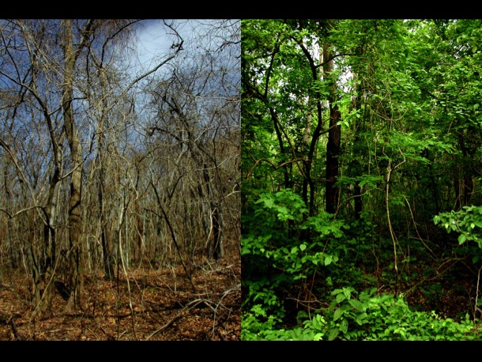

```{r setup, include=FALSE}

climate = read.table("clim.txt", header = TRUE)

```

## Monthly precipitation 

This is a boxplot showing the montly precipitation observed in the area considering data from 1942 to 2016.

```{r precipitation}

#Monthly precipitation

boxplot(climate$rain ~ climate$month,
ylab="Precipitation (mm)",
xlab="Month", col="blue")
```

## Average monthly temperature 

This is a boxplot showing the avreage monthly temperature in the area considering data from 1942 to 2016. Average temperature was estimated as the mean of the max and min temperatures. 

```{r average rain}

#Monthly average temperature

climate$avg.temp = (climate$tmin+climate$tmax)/2

boxplot(climate$avg.temp ~ climate$month,
ylab="Average Temperature (C)",
xlab="Month", col="orange")


```

```{r finding the wettest and the dryest years }

#Finding the wettest and the dryest years

year.rain = aggregate(climate$rain, by = list(climate$year), sum)
wet.year = year.rain[which.max(year.rain$x),1]
wet.year.rain= year.rain[which.max(year.rain$x),2]
dry.year = year.rain[which.min(year.rain$x),1]
dry.year.rain = year.rain[which.min(year.rain$x),2]


```

## The wettest and the dryest years

The wettest year between 1942 and 2016 was 1982, with a total precipitation of 2,136 mm. While the dryest year during the same period, was 2013 with a total precipitation of 264 mm.

## How does a wet and a dry year look in a Costa Rican Forest?

Here is a picture from a forest in the Guanacaste region in Costa Rica contrasting the wet and the dry seasons (Source: [Guanacaste dry forest conservation fund](http://www.gdfcf.org/biodiversity-species))



```{r seasons }
#Defining seasons 

climate$season = ifelse(climate$month == 4|climate$month == 5|climate$month == 6, 'spring', ifelse (climate$month == 7|climate$month == 8|climate$month == 9, 'summer',ifelse(climate$month == 10|climate$month == 11|climate$month == 12, 'fall' , 'winter')))

#Finding the wettest and dryest season

rain.season = aggregate(climate$rain, by= list(climate$season), sum)
dry.season = rain.season[which.min(rain.season$x),1]
rain.dry.season = rain.season[which.min(rain.season$x),2]
wet.season = rain.season[which.max(rain.season$x),1]
rain.wet.season = rain.season[which.max(rain.season$x),2]
```

## The wettest and the dryest seasons

The wettest season in this ecosystem is  winter, While the dryest season is summer. 

## Winter precipitation and summer temperature

There is no a clear realionship between the total precipitation accumulated over winter and the average summer temperature of the same year (see graph below). However, finding patterns between these type of climatic variables may be helpful to predict weather conditions and water supply for coming years. Allowing to anticipate the consequences of a drought for example. 

```{r summer temperature and winter ppt}

#Seasonal temperature and precipitation relation

summer= subset(climate, season == 'summer')
winter = subset(climate, season=='winter')

#Average summer temperature and total winter precipitation per year

summ.temp = aggregate(summer$avg.temp, by = list(summer$year), mean)
wint.rain = aggregate(winter$rain, by=list(winter$year), sum)

data.plot = data.frame(summ.temp, wint.rain$x)
colnames(data.plot) = c('Year', 'summer.temp', 'winter.rain')

library(ggplot2)

ggplot(data.plot, aes(summer.temp, winter.rain, col= Year)) + 
  geom_point()+
  xlab ('Average summer temperature (F)')+
  ylab ('Total winter precipitation (mm)')+
  theme_bw()
```

