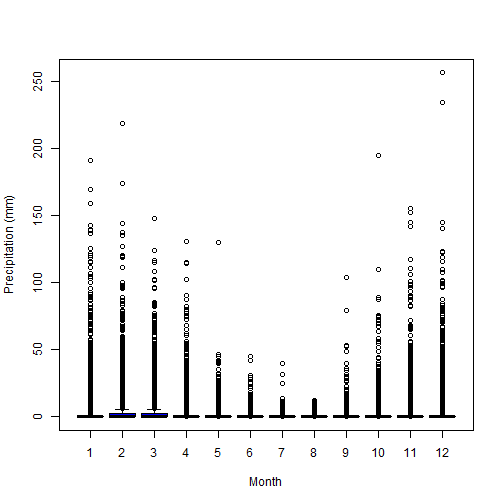
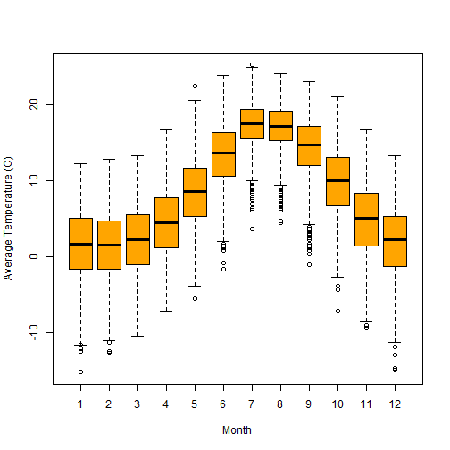
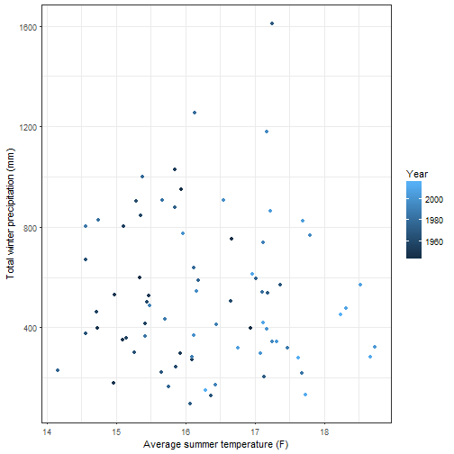

## Monthly precipitation 

This is a boxplot showing the montly precipitation observed in the area considering data from 1942 to 2016.



## Average monthly temperature 

This is a boxplot showing the avreage monthly temperature in the area considering data from 1942 to 2016. Average temperature was estimated as the mean of the max and min temperatures. 




## The wettest and the dryest years

The wettest year between 1942 and 2016 was 1982 with a total precipitation of 2135.378 mm. While the dryest year during the same period, was 2013 with a total precipitation of 263.398mm.

## How does a wet and a dry year look in a Costa Rican Forest?

Here is a picture from a forest in the Guanacaste region in Costa Rica contrasting the wet and the dry seasons (Source: [Guanacaste dry forest conservation fund](http://www.gdfcf.org/biodiversity-species))

<div align="center">  </div> 


## The wettest and the dryest seasons

The wettest season in this ecosystem is  winter with an accumulated total precipitation of 3.9526464 &times; 10<sup>4</sup> mm, between 1942 and 2016. While the dryest season during the same period, was summer with a accumulated total precipitation of 1956.054.

## Winter precipitation and summer temperature

There is no a clear realionship between the total precipitation accumulated over winter and the average summer temperature of the same year (see graph below). However, finding patterns between these time of climatic variables may be helpful to predict weather and the water supply of following years. Allowing to anticipate the consequences of a drought for example. 


```r
summer= subset(climate, season == 'summer')
winter = subset(climate, season=='winter')

#Average summer temperature and total winter precipitation per year

summ.temp = aggregate(summer$avg.temp, by = list(summer$year), mean)
wint.rain = aggregate(winter$rain, by=list(winter$year), sum)

data.plot = data.frame(summ.temp, wint.rain$x)
colnames(data.plot) = c('Year', 'summer.temp', 'winter.rain')

library(ggplot2)

ggplot(data.plot, aes(summer.temp, winter.rain, col= Year)) + 
  geom_point()+
  xlab ('Average summer temperature (F)')+
  ylab ('Total winter precipitation (mm)')+
  theme_bw()
```



